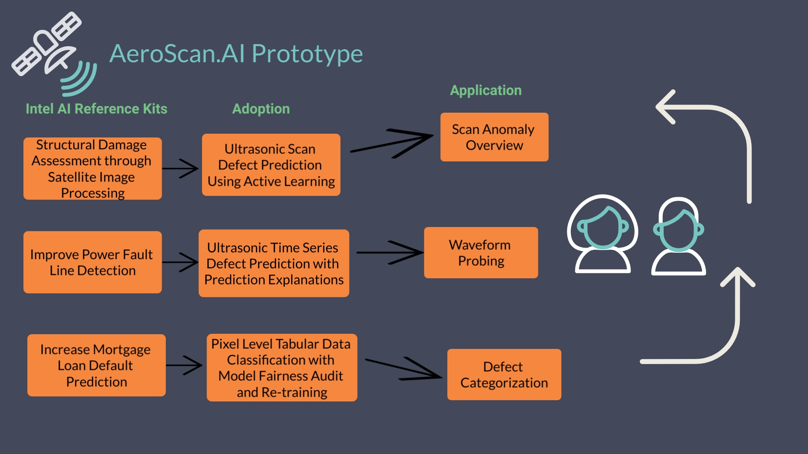

# AeroScan.AI

AeroScan.AI presents a highly sophisticated framework designed for the precise detection and categorization of anomalies in non-destructive inspection of spaceships. 

Finding defects in large surfaces poses a formiddable challenge when the defects are only few pixels wide.

This prototype aims to reduce the congnitive burden on the inspectors by leveraging AI-based solutions. 
 
Specifically, AeroScan.AI is a multi-phase solution that fuses models from different modalities including 3d-scans, time-series waveform, and tabular data to form an effecient for industrial aircraft inspection. The protoype is an user in-the-loop system and also provides feasability to readily scale to any application that deals with large 3D-data for defect inspection.




# Steps to run 

```
1. Request a large VM at cloud.intel.com
```

```
2. Login to the VM and run
sudo apt-get update && sudo apt-get install make
```

```
3. git clone https://github.com/rdverse/rdverseHACK.git
```

```
4. cd rdverseHACK/setup
```

```
5. make install-tools
(Hit enter when prompted for choice)
```

```
6. make launch-all
(see the Makefile in setup folder for launching one module at a time)
    6.a make launch-scan_anomaly (for phase-1 only)
    6.b make launch-waveform_probe (for phase-2 only)
    6.c make launch-defect_classify (for phase-3 only) 
    6.d make launch-app_ui (for ui only)
```

```
7. Open the browser and go to http://localhost:5005
```


# Presentation slides and demo
Please refer to docs/ folder for the presentation slides and demos.

# Note
Except scan_anomaly module, all other modules should be able to run on from tiny VM to Large VM. 
